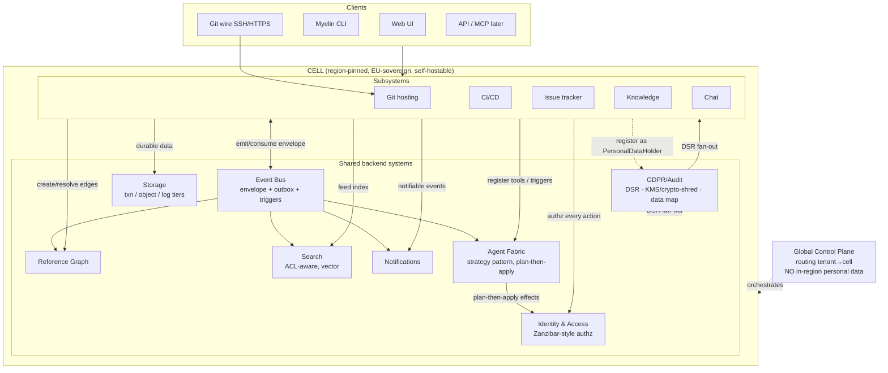

# Technical Structuring of the Platform

> Phase 1 research deliverable. Canonical brief: [`VISION.md`](../../VISION.md).
> Companion docs: [`personas.md`](./personas.md), [`use-cases.md`](./use-cases.md),
> [`competitive-landscape.md`](./competitive-landscape.md),
> [`gdpr-eu-sovereignty.md`](./gdpr-eu-sovereignty.md),
> [`agent-native-design.md`](./agent-native-design.md), and the five
> [`subsystem-deep-dives/`](./subsystem-deep-dives/).
>
> **This is research/structuring, not architecture.** It describes *how the platform is
> structured to meet the needs* and — crucially — **how the glue between the subsystems
> functions**. It deliberately enumerates options and trade-offs without locking choices.
> Phase 2 (`02-holistic-architecture`) and Phase 3 (`03-shared-systems-architecture`)
> commit the decisions; this document is the foundation they build on.
>
> **Honesty about uncertainty (VISION §3).** Open questions, assumptions, and deferrals are
> flagged inline as **[OPEN]**, **[ASSUMPTION]**, **[DEFER]**, and collected in §13. Where a
> companion doc already owns a decision or open question, this doc *references* it rather
> than re-deciding it.

---

## 0. How to read this document

The deliverable answers one question above all: **what makes Myelin one platform rather than
five tools wired together?** The answer is the **shared backend systems** and the **integration
seams** between subsystems. Accordingly:

- §1 states the structuring thesis and the layering.
- §2 describes each **shared backend system** and what it owns (the heart of the document).
- §3 describes the **glue**: the canonical event/reference/identity contracts that every
  subsystem speaks.
- §4 shows **how each subsystem plugs in** (the integration seams), with a seam matrix.
- §5 covers **multi-tenancy, residency, and world-scale** at a structural level.
- §6 covers the **agent fabric as a structural boundary** (strategy pattern, mock→real).
- §7 covers **GDPR/erasure as a structural property** (the PersonalDataHolder contract).
- §8 lists **candidate technology directions** (options + trade-offs; Rust steer noted, not
  locked).
- §9 covers **build/repo structure** (monorepo vs polyrepo, service boundaries, shared
  crates).
- §10 is the **high-level system diagram** (mermaid + ascii).
- §11 walks **two end-to-end flows** through the structure to validate it.
- §12 lists the **biggest structural risks**.
- §13 collects **open questions, assumptions, and deferrals**.

A naming note: the deep-dives and `agent-native-design.md` use slightly different illustrative
event names (e.g. `git.pr.opened` vs `pr.opened`). This document treats the **envelope and the
addressing scheme** as the real contract (§3) and the exact dotted names as a Phase-3
deliverable; it does not try to reconcile every illustrative name.

---

## 1. The structuring thesis

### 1.1 One sentence

**Myelin is a set of subsystem services that own their own domain state, sitting on top of a
set of shared backend systems that own identity, events, references, search, notifications,
storage, the agent fabric, and the GDPR/audit machinery — such that every subsystem speaks
one identity model, emits/consumes one event stream, and contributes to one reference graph.**

The differentiator (per `competitive-landscape.md §6`) is precisely this shared layer: the
incumbents are *integrated-by-API* (Atlassian, Microsoft) or *unified-but-not-sovereign*
(GitLab). Myelin is unified *by construction* because the shared layer is the substrate, not a
bridge.

### 1.2 The layering (conceptual, not deployment)

```
┌──────────────────────────────────────────────────────────────────────────┐
│  CLIENTS:  Web UI · Myelin CLI · Git wire (SSH/HTTPS) · API · MCP (later)  │
└──────────────────────────────────────────────────────────────────────────┘
                                   │  (one API surface, many consumers)
┌──────────────────────────────────────────────────────────────────────────┐
│  SUBSYSTEM SERVICES (own their domain state)                               │
│    Git hosting · CI/CD · Issue tracker · Knowledge · Chat                  │
└──────────────────────────────────────────────────────────────────────────┘
        │ emit/consume events · resolve refs · check perms · register holders │
┌──────────────────────────────────────────────────────────────────────────┐
│  SHARED BACKEND SYSTEMS (the glue)                                         │
│    Identity & Access · Event Bus · Reference Graph · Search · Notif        │
│    Agent Fabric · Storage · GDPR/Audit (DSR orchestrator, KMS, data map)   │
└──────────────────────────────────────────────────────────────────────────┘
        │ all of the above run inside …                                      │
┌──────────────────────────────────────────────────────────────────────────┐
│  CELL SUBSTRATE (region-pinned, EU-sovereign, portable, self-hostable)    │
│    commodity primitives: containers · Postgres-class · object store ·     │
│    event log · KMS — NO hard hyperscaler dependency                       │
└──────────────────────────────────────────────────────────────────────────┘
                  ▲
        ┌─────────┴──────────┐
        │  GLOBAL CONTROL     │  (holds NO in-region personal data;
        │  PLANE (EU-sovereign)│   routes tenants → cells, orchestrates)
        └────────────────────┘
```

Three load-bearing structural commitments, all inherited from the companion docs:

1. **Subsystems own their state; shared systems own the cross-cutting concerns.** No subsystem
   reaches into another subsystem's database. Cross-subsystem interaction happens only through
   the shared contracts (events, refs, identity, search). This is what keeps "five subsystems"
   from collapsing into a monolith *and* keeps them from drifting into five disconnected
   products.

2. **The cell is the unit of sovereignty and scale.** (`gdpr-eu-sovereignty.md §4`.) A cell is
   a complete, region-pinned stack of all subsystems + shared systems. Tenants are assigned to
   cells. Scale = many cells; residency = the cell's region; breach blast-radius = one cell;
   self-host = one cell on the customer's infra. This squares "world-scale from day 1" with
   "EU-sovereign by construction" without leaning on a US hyperscaler's global managed
   services.

3. **Everything is multi-tenant and every record carries `tenant` + `region`.** Not an
   afterthought column — part of the partitioning key and the routing address
   (`gdpr-eu-sovereignty.md §3.1–3.2`; every deep-dive says this).

---

## 2. The shared backend systems

This is the core of the document. For each: **what it owns**, **what it must guarantee**,
**how subsystems use it**, and **the key structural open questions** (deferred to Phase 3,
where these systems are designed in detail).

### 2.1 Identity & Access (Id)

**Owns:** the single `Principal` abstraction and the single permission model used by *all five
subsystems and the agent fabric*. (`agent-native-design.md §1`; every persona doc; `UC-X-6`.)

**Principal kinds** (`agent-native-design.md §1.1`): `Human`, `Agent`, `Service`. Agents are
first-class principals, not bot tokens (this is the answer to P12's deepest fear and a VISION
non-negotiable). `Service` vs `Agent` as one-type-with-flag or two-types is **[OPEN]**.

**Structural responsibilities:**
- **Authentication**: SSO (SAML/OIDC), SCIM provisioning/deprovisioning, MFA, passkeys, SSH
  keys (for git), scoped service/API tokens, short-lived job tokens (for CI), and scoped agent
  tokens. (`UC-CORP-1/2/6/7`.)
- **Authorization**: one policy engine evaluated identically for humans and agents. The
  org/team/project hierarchy with inheritance is here, *not* re-invented per subsystem.
- **Permission model shape is [OPEN] and consequential.** Multiple deep-dives independently
  conclude that simple RBAC is insufficient and a **relationship-based / Zanzibar-style tuple
  store** is likely required: issue-tracker needs field/transition/confidential-issue
  visibility (`issue-tracker.md §9.1`); knowledge needs page-tree inheritance with overrides
  (`knowledge-platform.md §2.7, §9.1`); chat needs per-viewer permission-aware unfurls
  (`chat.md §5.4`); search and the reference graph need **permission-filtered reads at scale**
  without N+1 checks or leaks. The recommendation to carry into Phase 3: **a shared
  authorization service capable of relationship-based access control with fast, cacheable
  per-(subject,object) decisions**, because permission-aware search/refs/unfurls is the single
  most pervasive cross-cutting correctness hazard in the platform.
- **Delegated authority ("on-behalf-of")** for agents: effective permissions =
  `agent.policy ∩ delegation ∩ tenant.policy` (`agent-native-design.md §1.3`). The exact
  algebra is **[OPEN]** (deferred to the Phase-3 authz pass).
- **Lifecycle**: offboarding, ownership transfer of orphaned artifacts, break-glass access,
  tenant decommission (`UC-EDGE-16/19/20/37`). Identity is also **where erasure-vs-integrity is
  ultimately resolved** via pseudonymisation/identity-indirection (`gdpr-eu-sovereignty.md
  §8.1`).
- **Data-role classification**: every principal/record tagged `tenant-content` (Myelin =
  processor) vs `platform-operational` (Myelin = controller) — drives DSAR routing and
  deletion authority (`gdpr-eu-sovereignty.md §1.1`).

**How subsystems use it:** every entrypoint (SSH, HTTPS git, API, UI, CLI, *and the
event-triggered agent path*) authenticates and authorizes through Id; no privileged
back-channel. Subsystems express their *permission needs*; Id owns enforcement.

### 2.2 Event Bus (Bus) — the backbone

**Owns:** the canonical, versioned, ordered, durable stream of domain events that is the
substrate for **event propagation and triggers** (the VISION's agent-native non-negotiable),
and simultaneously the feed for the reference-graph builder, search indexer, notifications,
delivery analytics, and external webhooks. (`agent-native-design.md §2`; every deep-dive
§"Events".)

**What it must guarantee (structural contract — details are Phase-3 [DEFER]):**
- **A common event envelope** (`agent-native-design.md §2.3`): `event_id` (idempotency anchor),
  `type`, `schema_ver`, `occurred_at`/`recorded_at`, `tenant`, `region`, `actor`
  (human/agent/service incl. on-behalf-of), `subject` (an `ArtifactRef`, §3.1),
  `causation_id` + `correlation_id` (provenance + loop capping), `contains_personal_data`,
  `visibility`. **This envelope is a primary glue contract** — every subsystem emits it.
- **Ordering per aggregate** (all events for one PR / one issue / one run are ordered);
  global ordering is *not* required (every deep-dive agrees).
- **Delivery guarantee is [OPEN] but the working assumption is at-least-once + idempotent
  consumers** (exactly-once *effect* via the `event_id` dedup key). CI, issue-tracker, and
  agent-native docs all assume this and demand it be confirmed in Phase 3. The choice drives
  idempotency requirements on *every* consumer, so it is load-bearing.
- **Emission integrity via the transactional outbox pattern**: an event is emitted **iff** the
  underlying state change committed (no ghost/lost events on a busy git server or CI scheduler).
  (`git-hosting.md §7.1`; `agent-native-design.md §2.1` leans outbox/CDC by default, reserving
  true event-sourcing for high-audit aggregates like issue transitions and permission changes.)
- **Bounded retention + crypto-shred + tombstones** so the append-only log does not defeat
  erasure (`gdpr-eu-sovereignty.md §6.2`). The **strong default is references-not-payloads**:
  events carry IDs, personal data lives in an erasable store the event points to.
- **A separate high-throughput path for firehose streams.** CI logs (`ci.log.appended`),
  chat presence/typing/read-state, and collab op-streams must **not** traverse the general
  durable bus the same way (`continuous-integration.md §8.3`; `chat.md §2.6`;
  `knowledge-platform.md §7`). Structurally: **control/domain events on the durable bus;
  high-volume ephemeral/firehose streams on dedicated transports**, with the bus carrying only
  "data available/updated" pointers. This split is a major Phase-3 bus-design input.

**Trigger/automation layer on top of the bus** (`agent-native-design.md §3`): three increasing
tiers — **Subscriptions** (deliver matching events), **Automations** (durable multi-step
workflows), **Agent triggers** (wake an agent with the event). A `Trigger` binds an
`EventMatcher` to a target under a `run_as` principal with a `RunBudget`, a `DelegationPolicy`,
and HITL `gates`. **Recommendation carried forward: automations and agents are the *same*
trigger engine with different action handlers** (every relevant deep-dive independently reaches
this — issue-tracker §7.3, CI §4, knowledge §7.3), so "automation" and "agent" are not two
systems.

### 2.3 Cross-Artifact Reference Graph (Refs)

**Owns:** the bidirectional, live, permission-aware graph of edges between **any** artifact and
any other — the mechanism by which a chat message references a commit/issue/doc/CI run and that
link **stays meaningful and resolves to current state** (`UC-X-8`; `chat.md §2.4`;
`knowledge-platform.md §2.6`; the densest consumers are chat and knowledge).

**Structural model:**
- **Universal addressing**: `ArtifactRef` = `myelin://<tenant>/<subsystem>/<type>/<id>[#sub]`
  (`agent-native-design.md §2.4`). Every subsystem must expose **stable, resolvable identifiers**
  for its artifacts down to sub-artifact granularity (a PR comment, a doc block, a CI step).
  (`git-hosting.md §2.3`; `knowledge-platform.md §2.6`.)
- **Edges are events**: a `ref.created`/`ref.removed` event adds/removes an edge
  `(source) --rel--> (target)`. The graph is *built from* the event stream, so any subsystem
  (or agent) creating a reference is just emitting the event. (`agent-native-design.md §2.4`.)
- **Backlinks** = the inverse-index read ("what references this?"). Must be **permission-filtered
  at read time** (you only see backlinks from things you can read) — the same hard
  graph-×-access-control join that recurs everywhere (`knowledge-platform.md §5.3`).
- **Live resolution**: refs render by *current* title/state, resolved per viewer, degrading
  gracefully (tombstone placeholder) when a target is deleted/erased (`chat.md §2.4`;
  `knowledge-platform.md §2.6`).
- **Hot-artifact scale** (`UC-EDGE-6`): a popular issue/PR may have thousands of inbound edges;
  graph queries must stay fast.

**Two cross-cutting design questions [OPEN]:**
- Does the **issue tracker's hierarchy/relations** (epic→story, blocks/blocked-by) live as edge
  types *in* Refs, or as a tracker-local materialised tree projected into Refs? World-scale
  rollups may force a local tree (`issue-tracker.md §3.5, §6.3`).
- Does a **Knowledge database "relation"** ride Refs or a private relation index that feeds it?
  Strong reuse argument for Refs (`knowledge-platform.md §2.4`).
- **Cross-tenant references** (a public OSS repo referenced from another tenant) must **not turn
  Refs into a personal-data side-channel across tenant boundaries** (`gdpr-eu-sovereignty.md
  §3.1`). Structural rule: Refs is tenant-partitioned; cross-tenant edges are a special,
  visibility-gated case.

### 2.4 Search & Indexing (Search)

**Owns:** unified ranking across **all artifact types** in one query (`UC-X-2`) *and*
per-subsystem search (code, docs, chat, issues, CI runs).

**Structural responsibilities:**
- **Permission-aware at query time** — *the* recurring hazard: "a user must never find what they
  cannot access" (`use-cases.md §8.4`; flagged in every deep-dive). Post-filtering large result
  sets leaks and is slow; this must be co-designed with Id's authorization service.
- **Near-real-time incremental indexing** fed by the event bus (subsystems emit; Search indexes).
- **Multiple query shapes**: full-text (chat/docs/code/issues), structured/field query (issue
  custom fields, knowledge database properties), and **semantic/vector** search for agent RAG and
  triage deduplication (`UC-AG-6`; `knowledge-platform.md §2.9`). **Embeddings are personal data**
  and must be erasable (`gdpr-eu-sovereignty.md §6.6`).
- **Multilingual** (EU = many languages; per-language analyzers) (`chat.md §5.5`;
  `knowledge-platform.md §2.9`).
- **Residency-pinned indices** per tenant; the index inherits the tenant's region.
- **Scale to millions of artifacts** with good relevance (`UC-EDGE-3`); code search at world
  scale is itself a multi-year effort and is **scoped down for v1** (`git-hosting.md §4.5`).

### 2.5 Notifications (Notif)

**Owns:** the **one prioritised, cross-subsystem "what needs *me*" inbox** (`UC-X-7`) and the
delivery fabric (email/push/web/mobile/desktop) — explicitly *not* owned by chat
(`chat.md §1`).

**Structural responsibilities:**
- Consume the event bus; apply per-user routing, preferences, quiet hours/DND, and **storm
  control / dedup** (`UC-EDGE-4`).
- **On-call / escalation routing** for agent escalations (`UC-AG-19`, `UC-EDGE-25`).
- Targeted write-fanout for "you were mentioned" while bodies stay read-fanout (`chat.md §5.2`).
- Notification history is a PersonalDataHolder (erasable) (§7).

### 2.6 Agent Fabric (Agents)

**Owns:** the **strategy-pattern boundary** behind which a `MockAgentRuntime` lives today and an
`LlmAgentRuntime` lives later — a config/implementation swap, not a rewrite (VISION
non-negotiable; `agent-native-design.md §4`). Detailed in §6 because it is both a shared system
*and* the platform's defining structural seam.

In brief, it owns: agent identities (via Id), the `AgentRuntime`/`Agent`/`ToolSurface`/
`EventInbox`/`EffectApi` traits, the **plan-then-apply** execution model (agents return *proposed
effects*; the platform validates against permissions/budget/HITL gates and applies them), the
permissioned **tool registry** (one catalogue, exposable internally and over MCP later), and the
**safety machinery** (budgets, rate limits, loop/runaway protection, HITL gates, attribution,
audit).

### 2.7 Storage (Storage)

**Owns:** the durable primitives every subsystem leans on, with residency + crypto-shred baked in.

**Structural shape:** the deep-dives converge on **three tiers** because data profiles differ
radically:
- **Transactional store** (Postgres-class): domain state — repos/PR metadata, issues, doc
  blocks/rows, messages metadata, run state.
- **Object/blob store** (S3-compatible): LFS blobs, CI artifacts/caches, doc media, attachments,
  avatars, clone bundles, backups — content-addressed, dedup, residency-pinned.
- **Log/firehose store**: CI logs, chat message logs, collab op-streams — append-mostly,
  tail+archive, range-read.

CI is the **heaviest storage consumer and will drive shared-storage requirements**
(`continuous-integration.md §2.2, §10`). All tiers carry per-tenant envelope encryption and
crypto-shred (§7).

### 2.8 GDPR / Audit machinery (the compliance shared system)

**Owns:** the cross-cutting machinery that makes "GDPR by construction" a structural property,
not a feature (`gdpr-eu-sovereignty.md §5`). Treated as a first-class shared system:

- **PersonalDataHolder interface** (`gdpr-eu-sovereignty.md §5.1`): every store/subsystem
  implements `locate / export / rectify / restrict / erase` for a subject. **This is the single
  most important shared contract for GDPR** (§7).
- **DSR Orchestrator**: fans a data-subject request to every holder, tracks the statutory
  deadline, produces verifiable receipts; operable by Myelin *and by/for tenants*.
- **KMS / key-custody**: per-tenant key hierarchy, envelope encryption, BYOK/HYOK,
  **crypto-shredding as a first-class deletion primitive**.
- **Tamper-evident audit log**: append-only, minimised, retention-bounded, per-tenant
  exportable; records every human *and agent* action (`UC-X-16`).
- **Data map / classification registry**: schema-level personal-data tagging → generated
  inventory → RoPA, DPIA inputs, breach scoping.
- **Retention engine, consent registry, sub-processor/transfer registry.**

---

## 3. The glue — canonical cross-subsystem contracts

The previous section described the shared *systems*. This section names the **three contracts**
that constitute the actual glue. If a subsystem speaks these three, it *is* part of Myelin; if it
doesn't, it's a bolt-on. (`use-cases.md §3` calls the triad **Id + Bus + Refs** "the wedge".)

### 3.1 The addressing contract: `ArtifactRef`

Every artifact in every subsystem is addressable as `myelin://<tenant>/<subsystem>/<type>/<id>
[#sub]`, resolvable to: (a) its current rendered projection (for unfurls/embeds), (b) a
permission check ("can principal P see this?"), and (c) update events for cache invalidation.
This is what lets chat unfurl anything, knowledge embed anything, and Refs link anything.
(`chat.md §8.2` enumerates exactly this requirement against each subsystem.)

### 3.2 The event contract: the common envelope

Every meaningful state change is emitted as an event in the common envelope (§2.2) via the
transactional outbox. Consumers (Search, Refs, Notif, Agents, analytics, other subsystems) react.
This is the propagation backbone. **Per-aggregate ordering + idempotency keys + `tenant`/`region`/
`actor`/`correlation_id`** are the non-negotiable envelope fields.

### 3.3 The identity contract: one principal, checked everywhere

Every action — human, agent, or service; via UI, CLI, git wire, API, or event-trigger — resolves
to a `Principal` and is authorized by the one policy engine. Agents inherit bounded authority via
on-behalf-of delegation. No subsystem implements its own auth.

### 3.4 Secondary shared contracts (built on the triad)

- **PersonalDataHolder** (§7) — the GDPR fan-out contract every store registers with.
- **ToolDef / ToolSurface** (§6) — how a subsystem exposes an action to agents (and later MCP).
- **The shared rich-content/block model** — a strong **[OPEN]** recommendation that chat
  messages, issue descriptions/comments, and knowledge blocks share one structured content
  representation (`chat.md §2.3, §9-11`; `knowledge-platform.md §9.2`; `issue-tracker.md §3.1`).
  Big upside (consistent rendering, mentions/refs as first-class nodes, one editor), real
  coordination cost.
- **The shared "database/views" primitive** — issues and knowledge databases are both "typed
  records + multiple views (table/board/calendar/timeline) + filters". `competitive-landscape.md
  §3/§4` and both deep-dives recommend **sharing the field-definition and view-query primitives**
  while keeping the issue lifecycle/workflow/SLA engine tracker-specific. Highest-impact
  cross-subsystem boundary decision (`knowledge-platform.md §10 Q1`; `issue-tracker.md §3.7`).
- **A single query AST** serving UI, CLI, API, automations, and agent triggers — recommended by
  the issue-tracker (`§5.4`) and useful platform-wide.

---

## 4. How the subsystems plug in — the integration seams

Each subsystem is a service that **owns its domain state** and plugs into the shared layer the
same way: it authenticates/authorizes via Id, emits/consumes the event envelope via Bus, exposes
`ArtifactRef`s and creates edges in Refs, feeds Search, produces notifiable events for Notif,
registers tools with the Agent Fabric, and implements PersonalDataHolder. The *differences* are
which subsystems couple tightly to which.

### 4.1 What each subsystem owns vs delegates

| Subsystem | Owns (its core competency) | Delegates to shared layer |
|---|---|---|
| **Git hosting** | Git object store, refs, packfiles, PR/review/diff-anchoring, branch protection, push-time policy hooks | Id (SSH keys, authz), Bus (push/PR events), Refs (commit↔issue↔doc), Search (code index plumbing), Storage (LFS blobs, packs, bundles), Notif |
| **CI/CD** | Pipeline definition, the distributed job scheduler, runner fleet, sandbox/isolation, run state machine | Id (job tokens, secrets authz), Bus (triggers + status), Storage (logs/artifacts/caches — heaviest), Agents (executor substrate), Search, Notif |
| **Issue tracker** | Issue lifecycle/workflow state machine, hierarchy/rollup semantics, cycles/roadmaps/SLA engine, tracker query semantics, tracker analytics | Id (rich permissions — likely Zanzibar-style), Bus (transitions, analytics feed), Refs (issue↔PR↔doc↔chat↔run + hierarchy?), Search (custom-field index), Notif, scheduler/timer, OLAP read store |
| **Knowledge** | Block tree, rich-text/collab (CRDT/OT), databases + formula/rollup dataflow, page permissions tree, version history | Id (page-tree ACL inheritance), Bus (doc/row events), Refs (mentions/relations/backlinks — heaviest producer), Search (full-text+structured+vector), Storage (media + CRDT snapshots), Notif |
| **Chat** | Conversation/message model, real-time fan-out & connection tier, threads/read-state, unfurl rendering | Id (membership + per-viewer unfurl authz), Bus (heavy emit+consume), Refs (densest consumer; write-back edges), Search (ACL-filtered), Storage (attachments + message log), Notif (delivery), Agents (mentions = trigger surface) |

### 4.2 The subsystem-to-subsystem seam matrix

Direct subsystem coupling happens *only via the shared contracts*, but some pairs are
load-bearing. "→" = "primarily produces events/refs that the other consumes."

| From ↓ / To → | Git | CI | Issues | Knowledge | Chat |
|---|---|---|---|---|---|
| **Git** | — | push/PR → trigger pipelines; checks contract gates merge (**tightest seam**) | PR↔issue link, auto-close on merge | docs link files/commits (permalinks), docs-as-code | PR/commit/diff unfurls + review-in-chat |
| **CI** | check/status → gate merge, drive merge queue | — | status surfacing, transition gating, auto-incident on prod fail | runbooks/run reports | run unfurls, incident posts, re-run from chat |
| **Issues** | "closes #N" linkage, PR auto-link | issue transition → deploy trigger | — | issue ↔ PRD/spec/runbook | issue unfurls, create-from-message |
| **Knowledge** | docs-as-code, README render | knowledge page publish → trigger | spec/PRD ↔ epic; shared db/views primitive | — | doc unfurls; shared block model; comments overlap |
| **Chat** | "review this PR" from chat | slash-command run/cancel/approve | create issue from message, post activity | thread→doc summarisation | — |

**The two tightest seams** (call out for Phase 2/4 joint design):
1. **Git ↔ CI**: the **commit-status/checks contract** that gates merges, plus fork/trust-tier
   signals and branch-protection integration. Most load-bearing cross-subsystem relationship
   (`git-hosting.md §10.2`; `continuous-integration.md §10.2`).
2. **Issues ↔ Knowledge**: the **shared database/views and field-definition primitive**, the
   biggest reuse decision in the platform (§3.4).

### 4.3 The PR context pane — the wedge made concrete (`UC-X-3`)

The clearest single demonstration that the glue works: a PR view surfaces, inline, its linked
issue (Issues), the relevant doc section (Knowledge), the CI run (CI), and the discussion (Chat).
Structurally this is: Git resolves the PR's `ArtifactRef`s via **Refs**, renders each via the
target subsystem's projection API, **permission-filtered per viewer via Id**, kept live by **Bus**
update events. Every shared system participates; no subsystem reaches into another's database.
This single view is the integration test of the whole structuring thesis.

---

## 5. Multi-tenancy, residency & world-scale (structural)

This section reconciles two VISION non-negotiables that pull in opposite directions: **world-scale
from day 1** wants global managed services; **EU-sovereign by construction** forbids leaning on
them. The reconciliation is structural, from `gdpr-eu-sovereignty.md §2.2, §4`.

### 5.1 The cell-based, region-pinned topology

- **Cell = a complete region-pinned stack** (all subsystems + shared systems) on commodity,
  EU-deployable, self-hostable primitives. Tenants are assigned to a cell.
- **Scale = add cells** (not bigger global services). This is how Myelin scales without a US
  hyperscaler's proprietary global plane.
- **Residency = the cell's region.** Storage, compute, backups, search indices, caches, logs,
  event log, and **agent processing** all stay in-cell/in-region. **No silent cross-region
  replication.**
- **Breach blast-radius = one cell.** Per-tenant/per-cell erasure and offboarding are clean.
- **Self-host = one cell** on the customer's infra; the *same artifacts* run a managed cell and
  an on-prem install (forces clean packaging, no hidden cloud deps).
- **Global control plane** routes tenants→cells and orchestrates but **holds no in-region
  personal data** and is itself EU-sovereign (`gdpr-eu-sovereignty.md §4`).

### 5.2 Tenant isolation spectrum

One architecture must serve a 3-person startup and a 10,000-person enterprise (`UC-EDGE-1`).
Isolation is offered as a spectrum by tenant tier (`gdpr-eu-sovereignty.md §3.1`):
**logical** (shared infra, `tenant_id` + row-level security) → **schema/DB-per-tenant** →
**cell/stack-per-tenant** (dedicated; strongest isolation + cleanest residency; for
public-sector/high-assurance). Isolation must hold across **all** shared systems: bus topics,
search indices, caches, blob prefixes, agent context, reference-graph partitions. **[OPEN]**:
pooled vs siloed-per-region tenancy, tenant→cell assignment, and multi-cell tenants
(`gdpr-eu-sovereignty.md §10 Q8`).

### 5.3 World-scale mechanisms (per concern)

- **Statelessness + async via the bus**: subsystem front doors are stateless-ish; heavy
  cross-system work (reference-graph build, search indexing, rollup recompute, analytics) is
  **event-driven and async**, not synchronous in the write path (`issue-tracker.md §6.3`).
- **Sharding by tenant** for OLTP, with a **separate OLAP/read store fed by the event stream**
  (CQRS-style) for reporting/analytics that would otherwise kill the OLTP store
  (`issue-tracker.md §6.5`). The bus's durable event stream *is* the analytics source
  (`use-cases.md §8.2`).
- **Subsystem-specific scale hot-spots** (each owned by its Phase-4 agent): git ref-update
  consistency + monorepo + hot-repo/clone-storm (`git-hosting.md §11`); CI's distributed job
  scheduler + untrusted-code isolation + log firehose (`continuous-integration.md §5`); chat's
  millions-of-connections fan-out tier + per-viewer unfurl resolution (`chat.md §5`); knowledge's
  real-time collab + flexible-DB query + permission-filtered backlinks (`knowledge-platform.md
  §5`); issue-tracker's permission-filtered custom-field queries + rollups (`issue-tracker.md
  §6`).
- **Agent-generated load governance** (`UC-EDGE-8`): the bus/CI/chat must bound how much agents
  can drive them (budgets, quotas, loop caps) — a *novel* scale+safety concern because agents
  generate volume far beyond humans (§6.4).

---

## 6. The agent fabric as a structural boundary (strategy pattern)

The VISION's hardest structural mandate: **build for agents now with mock implementations behind
the strategy pattern, so mock→real is a config swap, not a rewrite.** This is fully designed in
`agent-native-design.md`; here is its *structural* role.

### 6.1 The boundary (one stable interface, two implementations)

The platform core depends **only** on a small trait set — `AgentRuntime`, `Agent`, `ToolSurface`,
`EventInbox`, `EffectApi` (`agent-native-design.md §4.1`). **No LLM SDK, prompt, or model name
appears anywhere in platform code**; all of that lives behind `LlmAgentRuntime`, introduced later.
`MockAgentRuntime` (deterministic, rule-driven) is what ships during development. Swapping = point
an agent identity's `runtime_ref` at a different runtime.

### 6.2 Plan-then-apply (the single most important structural choice)

Agents are a pure-ish function `(event, context) → AgentDecision { effects, ... }`. They **never
perform side effects directly**; they emit *proposed effects*. The platform's `EffectApi`
validates each effect against **permissions ∩ delegation ∩ tenant policy**, budget, and HITL
gates, then applies it — emitting domain events (which may wake more agents, governed by loop
caps). (`agent-native-design.md §4.4`.) This split is what makes mock agents deterministic and
testable *and* real agents safely sandboxed, with identical platform code for both.

### 6.3 Tools = one permissioned catalogue, two front-ends

Every subsystem registers typed tools (`ToolDef`: name + JSON-schema input + required caps +
effect kind + side-effecting flag) into the shared `ToolSurface` (`agent-native-design.md §4.2`).
The same registry is consumed internally by our runtimes **and** exposable over **MCP** to
external agents later — defined once, governed once. This is the structural reason "agents and
humans in the same channel" is coherent: an agent's only way to act is the same permissioned tool
catalogue, checked by the same Id engine.

### 6.4 Safety as a structural driver (not an appendix)

Agent-native makes safety load-bearing (`agent-native-design.md §5`). Structural mechanisms:
**least-privilege per-run permissions**; **per-run/per-agent/per-tenant budgets**; **loop/runaway
protection** via `causation_id` depth caps + cycle detection + idempotent tools + per-tenant
circuit breakers (the scariest failure mode — agents emit events that wake agents); **HITL gates**
(durable workflow waits, surfaced as chat approval cards); **attribution + tamper-evident audit**
of every agent action; **agents always labelled as agents** (AI Act transparency). The
human-in-the-loop default and "suggest-by-default, human-confirm consequential actions" satisfy
GDPR Art. 22 and the EU AI Act (`gdpr-eu-sovereignty.md §7`).

### 6.5 The CI ↔ agent substrate unification (promising, [OPEN])

A CI job and an agent run have nearly the same shape: an event arrives → sandboxed work runs →
results+events return. The CI sandbox substrate and the agent execution substrate are candidates
to **unify** (`continuous-integration.md §7, §11`) — efficient, and means the untrusted-code
threat model is shared (an agent running tool calls *is* untrusted code). Real architecture
decision with security implications; flagged, not decided.

---

## 7. GDPR/erasure as a structural property

Fully owned by `gdpr-eu-sovereignty.md`; here is the *structural* summary of how it threads
through the architecture, because "erasure reaching the bus, search, and reference graph" is a
property of the *whole* structure, not a settings page.

### 7.1 The PersonalDataHolder contract is the spine

**Every store and subsystem registers as a PersonalDataHolder** implementing `locate / export /
rectify / restrict / erase` (`gdpr-eu-sovereignty.md §5.1`). The **DSR Orchestrator** fans a
subject- or tenant-scoped request out to *all* holders, tracks the statutory deadline, and
produces verifiable receipts. "We forgot the search index" is a structural failure, so the
holder list is exhaustive: all 5 subsystem DBs, object store, **search index**, **event bus
history**, caches/CDN, **backups**, **agent memory/embeddings**, **reference graph**,
notification history, audit (carve-out + expiry).

### 7.2 The structural techniques that make erasure tractable

- **Keep personal data out of immutable structures.** Git history and event payloads carry
  **references + pseudonymous identities**, with the erasable mapping outside the immutable store
  (`gdpr-eu-sovereignty.md §6.1–6.2`; `git-hosting.md §9.2` recommends pseudonymous/no-reply
  commit identities; CI references identities rather than copying PII, `continuous-integration.md
  §9`).
- **Crypto-shredding as a first-class deletion primitive** (per-tenant, optionally per-subject
  envelope keys; destroy the key → ciphertext in DBs/backups/immutable logs is unrecoverable)
  (`gdpr-eu-sovereignty.md §3.3, §6.5`). This is the answer for backups, append-only logs,
  CI logs/artifacts, chat message bodies, and knowledge history.
- **References-not-payloads on the bus** + bounded retention so personal data ages out.
- **Tombstone + graceful degradation** in Refs/unfurls when a target is erased.
- **The single hardest tension** (carried from `personas.md §7`, `use-cases.md §5.3`,
  every deep-dive): **right-to-erasure vs the immutability/integrity of git history and audit
  logs.** The structural stance is *minimise PII entering immutable history* (pseudonymous
  identities) so the question rarely bites; the residual is documented best-effort +
  crypto-shred; the exact legal scope is **[OPEN — LEGAL]** and owned by Phase 3 + counsel.

### 7.3 Residency + audit are structural, everywhere

- **Region pinning is immutable-by-default and enforced at the data layer** so misrouting a
  tenant's personal data is *impossible*, not merely discouraged (`gdpr-eu-sovereignty.md §3.2`).
- **One tamper-evident audit trail** records every human *and agent* action on every artifact
  (`UC-X-16`) — and is itself a (carved-out, retention-bounded) PersonalDataHolder.
- **Every external personal-data-touching dependency is a swappable, region-aware,
  EU-preferring adapter** — the same strategy-pattern mandate that governs mock→real agents,
  generalised (`gdpr-eu-sovereignty.md §3.7, §8.9`). The future real LLM/agent backend is one
  such adapter and must be EU-hostable.

---

## 8. Candidate technology directions (options + trade-offs)

> **The VISION steers Rust as the default, not a requirement** (VISION §4). Each subsystem's
> Phase-4 agent chooses its own languages/tools/DB, justified in writing. The `.gitignore` is
> pre-seeded for Cargo + `cargo-mutants` (a quality-bar signal). Below are *candidates with
> trade-offs*, **not locked choices** — that is Phase 2/3/4 work. Where a deep-dive already
> surveyed options, this references it.

### 8.1 Backend languages

| Option | For | Against | Where it fits |
|---|---|---|---|
| **Rust** (default steer) | memory-per-connection (chat's millions of conns), no GC pauses, strong types, `gix`/`gitoxide`, `Yrs` (Rust Yjs), `Tantivy` (search); Mononoke proves a Rust scalable git server is feasible | smaller hiring pool; some ecosystems (server-side git serving via `gix`) **not yet feature-complete** (`git-hosting.md §12`) | the performance-critical cores: chat fan-out tier, event bus, CI scheduler, search |
| **Go** | great concurrency story, mature for network services, large ecosystem | GC pauses, weaker type system than Rust | viable for I/O-bound services if a subsystem justifies it |
| **Elixir/BEAM** | best-in-class for massive soft-real-time fan-out (Phoenix Channels) — directly relevant to chat | separate runtime/ops model; off the Rust steer | a candidate *specifically* for chat's connection tier (`chat.md §5.1`) |
| **TypeScript/Node** | frontend alignment, fast iteration | not for hot paths at world-scale | tooling, BFF layers, maybe some control-plane |

### 8.2 Datastores

- **Transactional**: **Postgres** is the portable, EU-deployable, self-hostable default
  (avoids hyperscaler lock-in per `gdpr-eu-sovereignty.md §2.2`). Distributed-SQL (CockroachDB/
  Yugabyte) is a candidate where a single shard outgrows Postgres. JSONB + GIN + generated
  columns is the pragmatic answer for flexible custom fields / database property bags
  (`issue-tracker.md §6.7`; `knowledge-platform.md §2.4`).
- **Wide-column** (Cassandra/Scylla): candidate for the chat message log (append-heavy,
  per-conversation, infinite growth) (`chat.md §5.3`).
- **Object store**: **S3-compatible** (MinIO/Ceph self-hostable; EU providers) — LFS, CI
  artifacts, media, backups.
- **Search**: OpenSearch/Elastic vs **Tantivy (Rust)** / Meilisearch — must be ACL-aware,
  multilingual, residency-pinned, with vector support (`chat.md §5.5`; `knowledge-platform.md
  §2.9`).
- **OLAP/read store**: a columnar store (ClickHouse-class) fed by the event stream for
  issue-tracker analytics and delivery health (`issue-tracker.md §6.5`; `UC-X-14`).
- **Authorization tuple store**: a Zanzibar-style store (SpiceDB-class) is the leading candidate
  for relationship-based, permission-filtered reads platform-wide (§2.1).

### 8.3 Event bus / streaming

- Candidates: **Kafka/Redpanda** (durable, partitioned, replayable, ordering-per-partition),
  **NATS (JetStream)** (lighter, EU-deployable, good fan-out), **Postgres logical
  decoding/outbox** (simplest, fewest moving parts at small scale). Must support **bounded
  retention + crypto-shred + tombstones on EU-deployable infra** (`gdpr-eu-sovereignty.md §10
  Q9`). The **firehose-vs-control-event split** (§2.2) likely means *two* transports.

### 8.4 Real-time / collaboration

- **CRDT (Yjs/`Yrs` Rust)** vs **OT** for knowledge collab — `knowledge-platform.md §6` leans
  CRDT (offline-first, Rust-aligned, "dumb relay" servers scale horizontally) but flags high
  uncertainty; must be prototyped. Chat real-time backplane: NATS/Redis pub-sub vs actor-model
  vs BEAM (`chat.md §5.1`). Presence/typing/read-state on a **dedicated ephemeral channel**, not
  the durable bus.

### 8.5 CI execution / isolation

- **microVM (Firecracker/Cloud Hypervisor)** as the conservative default for untrusted code,
  with hardened containers (gVisor) and self-hosted runners as other tiers
  (`continuous-integration.md §6.1, §7`). EU-sovereign compute constrains the menu (Hetzner/OVH/
  Scaleway/bare-metal rather than hyperscaler autoscaling primitives).

### 8.6 Durable workflow engine (for automations/HITL)

- **Temporal-style durable execution** (deterministic workflow + non-deterministic activities,
  durable timers, signals for HITL waits) is the right substrate for multi-step, human-gated
  agent/automation workflows. **Build-vs-adopt-vs-Temporal is a major [OPEN]** with cost and
  sovereignty implications (`agent-native-design.md §3.2, §7`).

### 8.7 Infra substrate

- **Containers/OCI + Kubernetes-or-equivalent**, Postgres, S3-compatible storage, an
  EU-deployable event log, a KMS abstraction — commodity primitives chosen for **portability +
  EU-deployability + self-hostability**, deliberately avoiding hyperscaler-locked managed
  services (`gdpr-eu-sovereignty.md §2.2, §4`). Target EU substrates: OVHcloud, Scaleway, IONOS,
  Hetzner, Exoscale, T-Systems/Open Telekom Cloud (`competitive-landscape.md §6.2`).

---

## 9. Build / repo structure (options + trade-offs)

> **[DEFER]** the final decision to Phase 2; here are the structured options. The repo is
> already a Cargo-seeded git repo (single repo today).

### 9.1 Monorepo vs polyrepo

| | Monorepo (recommended lean) | Polyrepo |
|---|---|---|
| **Shared contracts** | one source of truth for the envelope, `ArtifactRef`, traits, PersonalDataHolder — atomic cross-cutting changes | contract drift risk; versioned-package coordination tax |
| **Refactoring the glue** | easy to evolve a shared crate and all consumers together | painful; the exact "stitched" failure mode Myelin exists to avoid (`competitive-landscape.md §6.1`) |
| **Dogfooding** | Myelin can host itself; one CI graph | multiple CI graphs |
| **Build scale** | needs good build tooling (Cargo workspaces; partial/sparse if it grows) | smaller per-repo builds |
| **Team autonomy / blast radius** | weaker isolation | stronger per-team isolation |

The shared-glue thesis argues strongly for a **monorepo with a Cargo workspace** (or
polyglot monorepo) so the cross-cutting contracts can't drift — the single biggest structural
risk is the contracts rotting into "integrated-by-API". **[ASSUMPTION]** monorepo, revisit in
Phase 2.

### 9.2 Service boundaries

Boundaries follow the layering (§1.2): one deployable (or small cluster) per **shared system**
(Id, Bus, Refs, Search, Notif, Agent Fabric, Storage gateways, GDPR/DSR) and per **subsystem**
(Git, CI, Issues, Knowledge, Chat). A **cell** is the full set co-deployed in a region. The
**control plane** is a separate, global, personal-data-free deployable.

### 9.3 Shared crates/libraries (the contract surface as code)

Candidate shared crates that *are* the glue (so they live in one place and every subsystem
depends on them):
- `myelin-events` — the envelope, `ArtifactRef`, event taxonomy types, outbox helper.
- `myelin-identity` — `Principal`, capability/permission types, authz client.
- `myelin-refs` — reference-graph edge types + client.
- `myelin-agent` — the `AgentRuntime`/`Agent`/`ToolSurface`/`EffectApi` traits + `MockAgentRuntime`.
- `myelin-gdpr` — the `PersonalDataHolder` trait + DSR client + crypto-shred KMS abstraction.
- `myelin-content` — the shared rich-content/block model (if §3.4 adopts it).
- `myelin-query` — the shared query AST (if §3.4 adopts it).

These crates are the literal embodiment of "the glue": a subsystem becomes part of Myelin by
depending on them and implementing their traits.

---

## 10. High-level system structure (diagram)

### 10.1 Mermaid



### 10.2 ASCII (the glue at a glance)

```
   Human / Agent / Service  ── one Principal, one policy engine (Id) ──┐
                                                                       │
   ┌──────── Git ──── CI ──── Issues ──── Knowledge ──── Chat ─────────┘
   │            \      |        |            |            /
   │   (each owns its state; talks ONLY via shared contracts)
   │             \     |        |            |          /
   │   emit/consume EVENT ENVELOPE  ───────────────►  BUS ──► Search / Notif /
   │   resolve ArtifactRef + edges  ───────────────►  REFS         Refs / Agents
   │   register tools/triggers      ───────────────►  AGENT (mock→real, plan-then-apply)
   │   register PersonalDataHolder  ───────────────►  GDPR (DSR · KMS crypto-shred · audit)
   │
   └── all inside a region-pinned CELL on commodity EU primitives;
       many cells = world scale; control plane holds no personal data.
```

---

## 11. Two end-to-end flows validating the structure

These trace real `use-cases.md` flows through the structure to confirm the glue carries them.

### 11.1 CI failure → triage → issue → chat → fix PR (`UC-X-4` + `agent-native-design.md §8.1`)

1. CI commits run state, **outbox-emits** `ci.pipeline.failed` in the envelope (tenant, region,
   actor, correlation_id) onto **Bus**.
2. A **Trigger** matches → wakes a (mock) **TriageAgent** via the **Agent Fabric**, with an
   on-behalf-of delegation and a `RunBudget`.
3. Agent returns `AgentDecision { effects: [issue.create, ref.create(issue→commit),
   chat.post] }` — **proposes**, does not act.
4. **EffectApi** checks each effect against Id (permissions ∩ delegation ∩ tenant), applies them;
   Issues, **Refs**, and Chat commit their state and outbox-emit `issue.created`,
   `ref.created`×2, `chat.message.posted`.
5. A second trigger wakes a FixAgent; its `git.open_pr` is `sensitive` → returns **Gated**; a
   **HITL** approval card posts to Chat (durable workflow wait). A human approves → PR opens.
6. Throughout: one `correlation_id`, full audit trail, loop depth capped, every action attributed
   to its (agent) principal. **Every shared system participated; no subsystem touched another's
   DB.**

### 11.2 Spec-to-ship traceability + DSAR (`UC-X-1` + `UC-X-17`)

- A PRD in **Knowledge** links (edges in **Refs**) to epics/issues in **Issues**, which link to
  PRs in **Git**, which link to **CI** runs — all live, all permission-filtered per viewer via
  **Id**. The roadmap view (`UC-X-5`) pulls live delivery state from the same event stream via the
  OLAP read model.
- Later, a DSAR arrives: the **DSR Orchestrator** fans `locate/export` to every
  **PersonalDataHolder** (all 5 subsystem DBs + Search + Refs + Bus history + Storage + audit),
  assembling "everywhere this subject appears" in one inventory. Erasure uses crypto-shred +
  pseudonym-mapping deletion; immutable git history holds only pseudonymous identities so the
  hard tension is minimised. **The same structure that powers the wedge powers compliance.**

---

## 12. Biggest structural risks

Ranked by potential to undermine the platform thesis.

1. **The glue rots into "integrated-by-API."** If the shared contracts (envelope, `ArtifactRef`,
   identity, PersonalDataHolder) drift or are bypassed, Myelin becomes the stitched-together
   suite it exists to beat (`competitive-landscape.md §6.1`). **Mitigation:** the contracts as
   shared crates in a monorepo (§9.3); no subsystem-to-subsystem DB access, ever.
2. **Permission-aware reads at scale** (search, refs/backlinks, chat unfurls) are subtle and a
   classic leak vector; every deep-dive flags it. **Mitigation:** a shared authorization service
   (Zanzibar-style) co-designed with Search and Refs from the start, not retrofitted.
3. **Erasure vs immutability** (git history, audit logs, append-only bus). Genuinely hard,
   partly legally open. **Mitigation:** minimise PII in immutable stores (pseudonymous
   identities, references-not-payloads) + crypto-shred; document residual best-effort; counsel
   on scope. **[OPEN — LEGAL]**.
4. **The issue-model duality** (one model serving sprint-board *and* roadmap as co-equal views)
   — the issue tracker's make-or-break UX bet (`issue-tracker.md §0`; `use-cases.md §2.3`).
   Owned by Phase-4 Issues architecture.
5. **Event-bus delivery semantics + the firehose split** under-specified; drives idempotency
   everywhere and the whole CI-log/chat-stream design. **Mitigation:** decide at-least-once +
   idempotent consumers early in Phase 3; design the two-transport split explicitly.
6. **Agent loop/runaway + agent-generated load** — novel, under-specified industry-wide; agents
   waking agents can cascade. **Mitigation:** causation-depth caps, budgets, circuit breakers,
   idempotent tools — designed defensively, but wants adversarial load testing
   (`agent-native-design.md §5.3, §7`).
7. **Real-time collaboration (CRDT vs OT)** for knowledge (and shared with issue-tracker sync) —
   high-uncertainty, must be prototyped, dominates that subsystem's architecture
   (`knowledge-platform.md §6`).
8. **Durable-workflow build-vs-adopt** for automations/HITL — large effort with sovereignty
   implications.
9. **World-scale without a hyperscaler** — the cell topology is the answer, but multi-region
   collab/latency vs residency, CI runner-fleet elasticity on EU infra, and chat's
   millions-of-connections tier are each hard on commodity substrate.
10. **Shared-primitive over-reach** — sharing the content/block model, database/views primitive,
    and query AST is high-upside but high-coordination; getting the boundary wrong (too shared →
    can't get subsystem-specific performance; too separate → drift) is a real risk
    (`issue-tracker.md §3.7`; `knowledge-platform.md §10 Q1`).

---

## 13. Open questions, assumptions & deferrals

### 13.1 Structural assumptions made here (to validate in Phase 2/3)
- **[ASSUMPTION]** Cell-based, region-pinned topology as the reconciliation of world-scale +
  sovereignty (from `gdpr-eu-sovereignty.md §4`).
- **[ASSUMPTION]** Subsystems own their state; all cross-subsystem interaction via the shared
  contracts (Id + Bus + Refs + holders); no subsystem-to-subsystem DB access.
- **[ASSUMPTION]** Bus is at-least-once + idempotent consumers; per-aggregate ordering; outbox
  emission; firehose streams on a separate transport.
- **[ASSUMPTION]** Automations and agents are one trigger engine with different action handlers.
- **[ASSUMPTION]** Monorepo + Cargo workspace; the glue lives in shared crates.
- **[ASSUMPTION]** Rust for hot-path cores (default steer), per-subsystem choice otherwise.

### 13.2 Cross-cutting open questions seeded for Phase 2/3 (not resolved here)
- **[OPEN]** Permission model formalism (RBAC vs ABAC vs Zanzibar-style) and how to do
  permission-filtered search/refs/unfurls cheaply and leak-free. *(Owns the most pervasive risk.)*
- **[OPEN]** Delegation/on-behalf-of algebra for agents; `Service` vs `Agent` as one kind or two.
- **[OPEN]** Bus delivery guarantee (at-least-once vs exactly-once) and the firehose/control split
  transport(s); event-sourcing vs outbox per subsystem.
- **[OPEN]** Does Refs own issue hierarchy/relations and knowledge db-relations, or do subsystems
  keep local materialised structures projected into Refs?
- **[OPEN]** The shared **database/views + field-definition** primitive between Issues and
  Knowledge (highest-impact reuse boundary).
- **[OPEN]** The shared **rich-content/block model** across Chat, Issues, Knowledge.
- **[OPEN]** A single **query AST** for UI/CLI/API/automation/agents.
- **[OPEN]** Durable-workflow engine: build vs adopt vs Temporal (sovereignty-constrained).
- **[OPEN]** Tenancy↔residency model (pooled vs siloed per region), tenant→cell assignment,
  multi-cell tenants, control-plane design holding zero in-region personal data.
- **[OPEN]** CI-sandbox ↔ agent-execution substrate unification depth.
- **[OPEN — LEGAL]** Erasure scope into immutable git history / audit logs (Art. 17 limits);
  audit-log retention carve-out; EU AI Act final classification of agent capabilities.

### 13.3 Deferred entirely (owned by later phases / other docs)
- Concrete schemas, sharding internals, scheduler design, config-language spec, CRDT/OT
  decision, storage-engine choices — Phase 3/4.
- UI flows, screens, empty/loading/error states, the shared design language — Phase 2 design +
  Phase 4 sketches (VISION §2/§3).
- Per-subsystem hard problems — each deep-dive's §"hardest problems"/§"open questions" is the
  starting checklist for that subsystem's Phase-4 agent.
- GDPR mechanism details (DSR orchestrator design, KMS hierarchy, crypto-shred granularity) —
  owned by `03-shared-systems-architecture` (`gdpr-eu-sovereignty.md §11`).
- Pricing/packaging, GTM, legal certification roadmap (EUCS/NIS2/DORA/Gaia-X) — commercial/legal.

### 13.4 Things I did not independently verify
- Competitor internal-architecture details (Spokes/DGit, Gitaly/Praefect, Blackbird, Mononoke,
  GitLab Duo, CircleCI agents) and the EU sovereign-cloud facts are carried from the companion
  docs' own (flagged) research; re-verify before any decision hinges on them.
- All trait/interface/event-name sketches are *candidates* (the envelope and addressing
  **shape** is the contract, not the exact names); the Phase-3 shared-systems architecture is
  authoritative.

---

## 14. Cross-references
- [`VISION.md`](../../VISION.md) — canonical brief (subsystems, non-negotiables, phase plan).
- [`personas.md`](./personas.md) — who the structure serves; agent personas A1–A5.
- [`use-cases.md`](./use-cases.md) — the flows the structure must carry; §3 (wedge), §8
  (implications for shared systems) are the direct inputs to §2–§4 here.
- [`competitive-landscape.md`](./competitive-landscape.md) — why unified-∧-sovereign-∧-agent-native
  is the empty intersection; the "integrated vs stitched" framing behind §1 and risk #1.
- [`gdpr-eu-sovereignty.md`](./gdpr-eu-sovereignty.md) — owns §5 (cells/residency) and §7 (GDPR
  structural property); the PersonalDataHolder + DSR + crypto-shred contracts.
- [`agent-native-design.md`](./agent-native-design.md) — owns §6 (agent fabric, strategy pattern,
  plan-then-apply, safety) and the event envelope/trigger model in §2.2.
- [`subsystem-deep-dives/`](./subsystem-deep-dives/) — each subsystem's owned state, seams,
  hardest problems, and open questions; the source of §4's seam matrix.
- **Seeds Phase 2** (`02-holistic-architecture`): adopt the layering (§1.2), the cell topology
  (§5), the three glue contracts (§3), and the shared-design-language/views catalogue work.
- **Seeds Phase 3** (`03-shared-systems-architecture`): design the eight shared systems (§2),
  resolve the §13.2 open questions, own the GDPR machinery.
```
