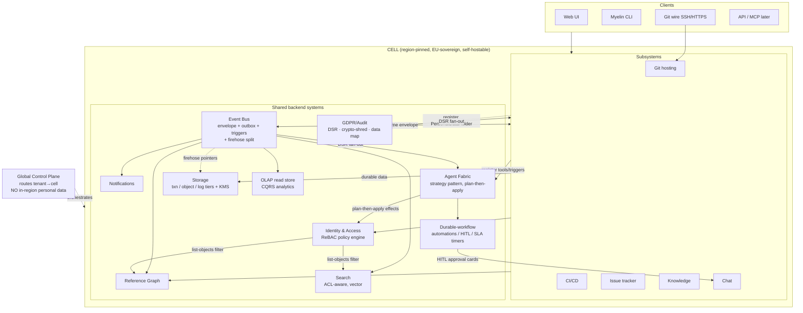
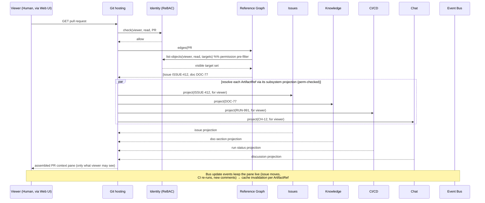
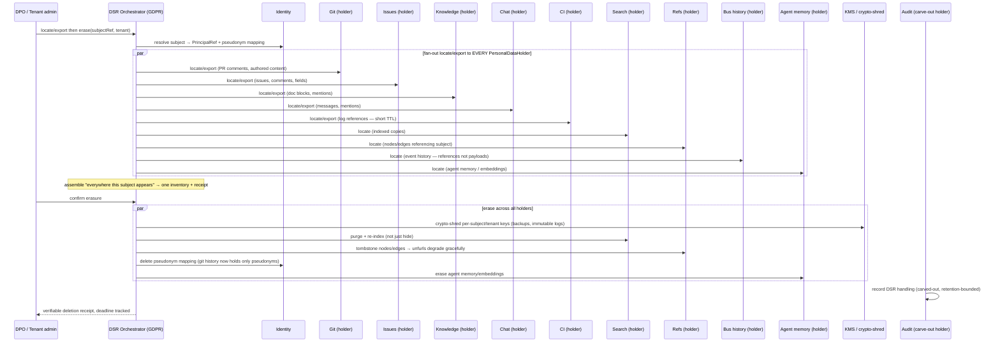

# Phase 2 — System Overview (the holistic architecture)

> Phase: `02-holistic-architecture`. Canonical brief: [`VISION.md`](../../VISION.md).
> Companion: [`architecture-decisions.md`](./architecture-decisions.md) (the ADR register —
> *what we decide and why*; this doc is *how the whole thing fits and interacts*). Phase-1
> foundation: [`01-research/technical-structuring.md`](../01-research/technical-structuring.md)
> (the structural thesis), and the rest of [`01-research/`](../01-research/).

This is **the map of the whole**. It tells the holistic story: the layering, how the eight
shared systems and five subsystems fit and interact end-to-end, the deployment/cell model and
how world-scale and EU-sovereignty are reconciled, the request and event lifecycles, and three
end-to-end walkthroughs that exercise every shared system at once. Decisions are cited to their
ADR; open questions are flagged `[OPEN → Pn]`.

---

## 1. The one-paragraph architecture

**Myelin is a set of subsystem services that own their own domain state, sitting on top of a
set of shared backend systems that own identity, events, references, search, notifications,
storage, the agent fabric, and the GDPR/audit machinery — all running inside a region-pinned
cell on commodity EU primitives, with a global personal-data-free control plane routing tenants
to cells.** Every subsystem speaks three glue contracts — one `ArtifactRef` addressing scheme,
one event envelope, one `Principal` checked by one policy engine (ADR-13) — and **never reaches
into another subsystem's database**. Cross-subsystem behaviour emerges *only* through the shared
layer. Agents are first-class principals that observe the same event stream and act through the
same permissioned tool catalogue as everything else (ADR-08). Because the shared layer is the
substrate rather than a bridge, the five subsystems are *one product by construction* — and the
same structure that powers the cross-subsystem wedge powers GDPR compliance and EU sovereignty.

---

## 2. The layering (clients → subsystems → shared systems → cell → control plane)

The conceptual layering (from `technical-structuring.md §1.2`, ratified by ADR-11/ADR-13):

```
┌────────────────────────────────────────────────────────────────────────────┐
│  CLIENTS                                                                     │
│  Web UI · Myelin CLI · Git wire (SSH/HTTPS) · API · MCP (external agents,    │
│  later) — one API surface, many consumers; one Principal authorizes all      │
└────────────────────────────────────────────────────────────────────────────┘
                                   │
┌────────────────────────────────────────────────────────────────────────────┐
│  SUBSYSTEM SERVICES  (own their domain state; talk ONLY via shared contracts)│
│   Git hosting · CI/CD · Issue tracker · Knowledge · Chat                     │
│   each: authz via Id · emit/consume envelope via Bus · expose ArtifactRefs   │
│         + edges via Refs · feed Search · notifiable events to Notif ·        │
│         register tools/triggers with Agents · implement PersonalDataHolder   │
└────────────────────────────────────────────────────────────────────────────┘
                                   │
┌────────────────────────────────────────────────────────────────────────────┐
│  SHARED BACKEND SYSTEMS  (the glue — the reason it's one platform)           │
│   Identity & Access (ReBAC) · Event Bus (envelope+outbox+triggers, +firehose)│
│   Reference Graph · Search (ACL-aware, vector) · Notifications ·             │
│   Agent Fabric (strategy pattern, plan-then-apply) ·                         │
│   Storage (txn/object/log tiers) · GDPR/Audit (DSR · KMS/crypto-shred · map) │
│   + Durable-workflow substrate (automations/HITL/SLA timers) · OLAP read store│
└────────────────────────────────────────────────────────────────────────────┘
                                   │  all of the above run inside …
┌────────────────────────────────────────────────────────────────────────────┐
│  CELL SUBSTRATE  (region-pinned, EU-sovereign, portable, self-hostable)      │
│   commodity primitives: containers/OCI · Postgres-class · S3-compatible ·    │
│   durable event log + firehose transport · KMS — NO hard hyperscaler dep     │
└────────────────────────────────────────────────────────────────────────────┘
                  ▲
        ┌─────────┴───────────┐
        │  GLOBAL CONTROL PLANE │  (EU-sovereign; routes tenants → cells;
        │  (no in-region PII)   │   orchestrates; holds NO in-region personal data)
        └───────────────────────┘
```

Three load-bearing commitments hold the layering together (ADR-13, ADR-11, ADR-01):

1. **Subsystems own their state; shared systems own the cross-cutting concerns.** No subsystem
   touches another's DB. This keeps five subsystems from collapsing into a monolith *and* from
   drifting into five disconnected products (the integrated-by-API failure mode, risk #1).
2. **The cell is the unit of sovereignty and scale.** A cell is a complete region-pinned stack;
   scale = many cells; residency = the cell's region; self-host = one cell (ADR-11).
3. **Every record carries `tenant` + `region`** as part of the partitioning key and routing
   address — region binding immutable and enforced at the data layer (ADR-11, ADR-12).

---

## 3. The eight shared systems and what they own

A compact reference (full detail: `technical-structuring.md §2`; decisions: the ADRs). These
are the units Phase 3 architects.

| Shared system | Owns | Key interactions | ADR |
|---|---|---|---|
| **Identity & Access** | One `Principal` (Human/Agent/Service); one ReBAC policy engine; SSO/SCIM/MFA/tokens; org→team→project hierarchy; agent delegation | Authorizes *every* action everywhere; gives Search/Refs the `list-objects` permission filter | ADR-03 |
| **Event Bus** | Canonical versioned envelope; transactional-outbox emission; per-aggregate ordering; at-least-once+idempotent; the trigger/automation engine; the firehose split | Fed by every subsystem; feeds Refs, Search, Notif, Agents, OLAP, webhooks | ADR-04 |
| **Reference Graph** | Bidirectional, live, permission-aware edges between any artifacts; backlinks; live resolution with tombstoning | Built from `ref.created` events; read-filtered by Id; the densest consumers are Chat & Knowledge | ADR-13 |
| **Search & Indexing** | Unified cross-artifact + per-subsystem search; full-text + structured + vector; multilingual; permission-aware at query time | Indexed off the bus; pre-filters via Id's `list-objects`; residency-pinned indices | ADR-03, ADR-10 |
| **Notifications** | The one prioritised cross-subsystem "what needs *me*" inbox; delivery fabric; storm-control/dedup; on-call/escalation | Consumes the bus; targeted write-fanout for mentions; a holder | ADR-12 |
| **Agent Fabric** | The strategy-pattern boundary (`MockAgentRuntime` now); plan-then-apply; the permissioned tool registry; safety machinery | Reads the bus (inbox), validates effects via Id, runs on the durable-workflow substrate | ADR-08 |
| **Storage** | Three tiers — transactional / object-blob / log-firehose; per-tenant envelope encryption + crypto-shred; residency-pinned | Every subsystem's durable backing; CI is the heaviest consumer | ADR-10 |
| **GDPR/Audit** | `PersonalDataHolder` contract; DSR orchestrator; KMS/crypto-shred; tamper-evident audit; data map/RoPA; retention/consent/sub-processor registries | Fans DSRs to *every* holder; audits every human+agent action | ADR-12 |

Plus two cross-cutting substrates ratified in Phase 2: the **durable-workflow engine** (ADR-09,
powering automations/HITL/SLA timers) and the **OLAP read store** (ADR-10, the CQRS analytics
model fed by the bus).

---

## 4. The five subsystems — what each owns vs delegates

From `technical-structuring.md §4.1` (ratified). Each owns its core competency and delegates
everything cross-cutting to the shared layer.

| Subsystem | Owns (core competency) | Delegates to shared layer |
|---|---|---|
| **Git hosting** | Git object store, refs, packfiles, PR/review/diff-anchoring, branch protection, push-time hooks | Id (SSH keys, authz), Bus (push/PR events), Refs (commit↔issue↔doc), Search (code index), Storage (LFS/packs/bundles), Notif |
| **CI/CD** | Pipeline definition, distributed job scheduler, runner fleet, sandbox/isolation, run state machine | Id (job tokens, secrets authz), Bus (triggers+status), Storage (logs/artifacts/caches — heaviest), Agents (executor substrate), Search, Notif |
| **Issue tracker** | Issue lifecycle/workflow state machine, hierarchy/rollups, cycles/roadmaps/SLA engine, tracker analytics | Id (ReBAC field/transition visibility), Bus (transitions, analytics feed), Refs (issue↔PR↔doc↔chat↔run), Search (custom-field index), Notif, durable timers (SLA), OLAP |
| **Knowledge** | Block tree, rich-text/collab (CRDT/OT), databases + formula/rollup, page-permission tree, version history | Id (page-tree ACL inheritance), Bus (doc/row events), Refs (mentions/relations/backlinks — heaviest producer), Search (FT+structured+vector), Storage (media+snapshots), Notif |
| **Chat** | Conversation/message model, real-time fan-out & connection tier, threads/read-state, unfurl rendering | Id (membership + per-viewer unfurl authz), Bus (heavy emit+consume), Refs (densest consumer), Search (ACL-filtered), Storage (attachments+log), Notif (delivery), Agents (mentions = trigger surface) |

**The two tightest seams** (joint Phase-2/4 design, `technical-structuring.md §4.2`):
1. **Git ↔ CI** — the commit-status/checks contract that gates merges (+ fork/trust-tier
   signals, branch-protection). The most load-bearing cross-subsystem relationship.
2. **Issues ↔ Knowledge** — the shared database/views + field-definition primitive (ADR-06),
   the biggest reuse decision in the platform.

---

## 5. How the parts interact — the glue in motion

### 5.1 The glue at a glance (ASCII)

```
   Human / Agent / Service ── one Principal, one ReBAC policy engine (Id) ──┐
                                                                            │
   ┌──────── Git ──── CI ──── Issues ──── Knowledge ──── Chat ──────────────┘
   │            \      |        |            |            /
   │   (each owns its state; talks ONLY via shared contracts; no cross-DB)
   │             \     |        |            |          /
   │   emit/consume EVENT ENVELOPE (outbox) ─────────►  BUS ─► Search / Notif /
   │       at-least-once + idempotent + per-aggregate order      Refs / Agents / OLAP
   │   resolve ArtifactRef + create edges ───────────►  REFS  (backlinks filtered by Id)
   │   register typed tools / triggers ──────────────►  AGENTS (mock→real, plan-then-apply,
   │                                                            on durable-workflow substrate)
   │   register PersonalDataHolder ──────────────────►  GDPR  (DSR · KMS crypto-shred · audit)
   │   firehose (CI logs / presence / collab ops) ───►  dedicated transport (pointers on BUS)
   │
   └── all inside a region-pinned CELL on commodity EU primitives;
       many cells = world scale; control plane holds NO personal data.
```

### 5.2 The two cross-cutting invariants that make it correct

Two invariants recur in every interaction and are the reason the architecture holds:

- **Permission-aware reads everywhere (ADR-03).** Search results, reference backlinks, chat
  unfurls, and issue lists are *pre-filtered* by Id's `list-objects` — never post-filtered.
  "A user must never find or see what they cannot access" is enforced at the query layer, not
  patched at the render layer. A leak here is both a security and a GDPR breach (SC-1).
- **Erasure reaches everything (ADR-12).** Every store — including the bus history, the search
  index, the reference graph, agent memory, and backups — is a `PersonalDataHolder`. The DSR
  orchestrator fans out to *all* of them. "We forgot the search index" is a structural failure.

### 5.3 Mermaid — the whole cell



---

## 6. Deployment / cell model — reconciling world-scale ∧ EU-sovereignty (ADR-11)

This is the structural answer to the two VISION non-negotiables that pull opposite ways.

### 6.1 What a cell is

```
            GLOBAL CONTROL PLANE (EU-sovereign, NO in-region personal data)
              tenant directory · cell router · provisioning/orchestration
                        │ routes tenant → cell (immutable region binding)
        ┌───────────────┼────────────────────────────┐
        ▼               ▼                            ▼
 ┌─────────────┐  ┌─────────────┐            ┌─────────────┐
 │ CELL: EU-W  │  │ CELL: EU-C  │   ...      │ CELL: cust- │   ← self-host = one cell
 │ (region A)  │  │ (region B)  │            │ on-prem     │     on customer infra
 │ all 5 subs  │  │ all 5 subs  │            │ all 5 subs  │
 │ all 8 shared│  │ all 8 shared│            │ all 8 shared│
 │ EU primitives│ │ EU primitives│           │ same artifacts│
 └─────────────┘  └─────────────┘            └─────────────┘
   tenants A1..An   tenants B1..Bn             tenant C
```

- **Scale = add cells**, not bigger global services. This is how Myelin reaches world-scale
  *without* a US hyperscaler's proprietary global plane (`gdpr-eu-sovereignty.md §2.2, §4`).
- **Residency = the cell's region.** Storage, compute, backups, search indices, caches, logs,
  the event log, and **agent processing** all stay in-cell. **No silent cross-region
  replication** (ADR-11; `gdpr-eu-sovereignty.md §3.2`).
- **Breach blast-radius = one cell.** Per-tenant/per-cell erasure and offboarding are clean.
- **Self-host = one cell** on the customer's infra, running the *same artifacts* as a managed
  cell — forcing clean packaging and no hidden cloud deps (`technical-structuring.md §5.1`).
- **Isolation spectrum by tier** (ADR-11): logical (RLS) → schema/DB-per-tenant →
  cell-per-tenant (dedicated; for public-sector/high-assurance).

### 6.2 The deliberate trade-off

Residency forecloses non-EU replicas/CDN for personal data, which conflicts with global
latency (SC-8). **This is accepted.** Mitigations (in-EU multi-region, clone-bundle caching,
read replicas within a region) are Phase-4 subsystem concerns. The hardest open item is
**multi-cell tenants** (a 10,000-person org spanning cells) and cross-cell collaboration —
`[OPEN → P3]` (SC-2/SC-3).

---

## 7. The request and event lifecycles

### 7.1 The synchronous request lifecycle (a human or CLI action)

```
Client (UI/CLI/git wire/API)
   │  1. authenticate → resolve Principal (Id)                      [ADR-13]
   ▼
Subsystem front door (region-routed by control plane; tenant+region on every record)
   │  2. authorize: Id.check(principal, permission, object)  (ReBAC) [ADR-03]
   │  3. mutate own domain state in a DB transaction                 [ADR-10]
   │  4. write the event to the OUTBOX in the SAME transaction       [ADR-04]
   ▼  (commit — state change and event emission are atomic)
   │  5. respond to client
   ▼
Outbox relay → EVENT BUS (at-least-once, per-aggregate order)        [ADR-04]
```

The subsystem never calls another subsystem synchronously in the write path; everything
downstream is async off the bus (§7.2). Reads that need cross-subsystem data (e.g. the PR
context pane) resolve `ArtifactRef`s via Refs and the target subsystem's projection API,
permission-filtered per viewer (§8.1).

### 7.2 The asynchronous event lifecycle (propagation)

```
EVENT BUS (canonical envelope: event_id, type, tenant, region, actor,
           subject=ArtifactRef, causation_id, correlation_id,
           contains_personal_data, visibility)                       [ADR-13]
   │  fan-out to consumers; each idempotent on event_id              [ADR-04]
   ├─► REFERENCE GRAPH builder    (ref.created/removed → edges)       [ADR-13]
   ├─► SEARCH indexer             (near-real-time incremental index)  [ADR-03,10]
   ├─► NOTIFICATIONS              (route, dedup, storm-control)       [ADR-12]
   ├─► OLAP read store            (CQRS analytics feed)               [ADR-10]
   ├─► TRIGGER/AUTOMATION/AGENT engine                                [ADR-08]
   │     EventMatcher (query AST) matches → Subscription | Automation | Agent
   │     Agent wakes → returns AgentDecision{effects} (plan-then-apply)
   │     EffectApi validates each effect vs (perms ∩ delegation ∩ tenant),
   │       budget, HITL gates → applies → emits MORE events
   │       (loop depth capped via causation_id; circuit breakers)     [ADR-08]
   └─► AUDIT (every human + agent action, tamper-evident)             [ADR-12]

Firehose streams (CI log lines, chat presence/typing, collab ops) ride a
SEPARATE transport; the durable bus carries only "data available" pointers. [ADR-04]
```

Note the recursion at the trigger engine: applied effects emit domain events, which may wake
more agents — this is the agent-native loop, governed by `causation_id` depth caps, cycle
detection, idempotent tools, budgets, and per-tenant circuit breakers (ADR-08 §safety; AG-4/5).

---

## 8. End-to-end walkthroughs (every shared system participating)

Three walkthroughs that exercise the whole architecture. Each cites the shared systems touched.

### 8.1 The PR context pane — the wedge made concrete (`UC-X-3`, ADR-13)

The clearest single demonstration that the glue works: a PR view surfaces, inline, its linked
issue, the relevant doc section, the CI run, and the discussion — no tab-hopping, each
permission-filtered per viewer, kept live.



**Shared systems exercised:** **Id** (per-viewer authz + `list-objects` filter), **Refs**
(the edges), **Bus** (live updates / cache invalidation), each subsystem's **projection API**
(via `ArtifactRef`). No subsystem reads another's DB — Git asks each subsystem to *project* its
own artifact for this viewer. This single view is the integration test of the whole structuring
thesis (`technical-structuring.md §4.3`).

### 8.2 CI fail → triage → issue → chat → fix PR (the agent-native flagship, `UC-X-4` + `agent-native-design.md §8.1`)

```mermaid
sequenceDiagram
  participant CI as CI/CD
  participant BUS as Event Bus
  participant AG as Agent Fabric
  participant ID as Identity
  participant ISS as Issues
  participant REFS as Reference Graph
  participant CHAT as Chat
  participant WF as Durable-workflow
  participant AUD as Audit
  participant H as Human (in chat)

  CI->>BUS: outbox-emit ci.pipeline.failed (tenant,region,actor,correlation_id)
  BUS->>AG: trigger T1 matches → wake MockTriageAgent (on-behalf-of pusher, RunBudget)
  AG->>AG: handle(event) → AgentDecision{ effects: issue.create, ref.create×2, chat.post }
  Note over AG: plan-then-apply: agent PROPOSES effects, performs NO side effects
  AG->>ID: EffectApi validates each effect (perms ∩ delegation ∩ tenant)
  ID-->>AG: allow (non-sensitive) → apply
  AG->>ISS: issue.create → ISSUE-412
  AG->>REFS: ref.create issue→commit, issue→run
  AG->>CHAT: chat.post "🔴 main red — opened ISSUE-412, triaging"
  ISS->>BUS: issue.created
  REFS->>BUS: ref.created ×2
  CHAT->>BUS: chat.message.posted
  AUD->>AUD: record every agent action (attributed, correlation_id)
  BUS->>AG: trigger T2 on issue.created → wake FixAgent
  AG->>ID: validate git.open_pr (SENSITIVE on protected repo)
  ID-->>AG: Gated → HITL required
  AG->>WF: open HITL gate (durable wait)
  WF->>CHAT: approval card "FixAgent proposes PR #88 — Approve/Edit/Reject"
  H->>WF: Approve (durable workflow signal — may be minutes or days later)
  WF->>AG: resume → apply git.open_pr → PR #88 opens
  Note over BUS,AUD: one correlation_id throughout; loop depth capped;<br/>full provenance in the audit log
```

**Shared systems exercised:** **Bus** (emit + triggers), **Agent Fabric** (plan-then-apply),
**Id** (effect validation + delegation), **Refs** (edges), **Durable-workflow** (the HITL gate
that waits days), **Notif/Chat** (the approval card surface), **Audit** (full provenance). The
*same* mock agent code runs deterministically today and an `LlmAgentRuntime` later with **zero
platform changes** — the strategy-pattern payoff (ADR-08). Every shared system participated; no
subsystem touched another's DB.

### 8.3 A DSAR / erasure fan-out — compliance on the same structure (`UC-X-17` + `UC-EDGE-17`, ADR-12)

A data-subject request (access then erasure) for a departed contributor. The same shared layer
that powers the wedge powers compliance.



**Shared systems exercised:** **GDPR/Audit** (DSR orchestrator + KMS), **Id** (subject
resolution + pseudonym mapping — where erasure-vs-integrity is resolved), **every subsystem +
Search + Refs + Bus history + Agent memory** as holders. The hard erasure-vs-immutability
tension is *minimised by construction*: git history and bus payloads hold only pseudonymous
identities and references, so destroying the pseudonym mapping + crypto-shredding the keys
satisfies erasure without rewriting immutable structures (ADR-12; `gdpr-eu-sovereignty.md §6`).
Backups age out within the bounded window + crypto-shred; the residual is documented best-effort
with `[OPEN — LEGAL]` scope (GD-1/GD-2).

---

## 9. Where this leaves Phase 3 and Phase 4

- **Phase 3 (shared systems)** owns the eight shared systems' detailed design and resolves the
  `[OPEN → P3]` backlog (ADR-15): the ReBAC tuple schema + consistency tokens, the bus +
  firehose transport selection, the durable-workflow build-vs-adopt, the KMS/crypto-shred
  hierarchy and DSR orchestrator, the cell sizing + multi-cell-tenant story, and the canonical
  event taxonomy. It must keep the GDPR constraints (ADR-12) intact.
- **Phase 4 (subsystems)** builds each subsystem *on these premises*, resolving the `[OPEN → P4]`
  backlog (issue-model duality, CRDT-vs-OT, flexible-field query, CI isolation, git storage
  backend, chat connection tier) — and, for any frontend, producing **design sketches before UI
  code** against the **shared design language** (the Phase-2 design deliverable, VISION §3/§5.2).
- **The shared design language** (principles, tokens, accessibility baseline, the catalogue of
  views and the primary screens per subsystem) is the *other half* of Phase 2 (Phase-1 README
  §5.4); it ships one editor over `myelin-content` (ADR-05) and one views component over the
  shared database/views primitive (ADR-06), so every frontend stays coherent.

---

## 10. Cross-references
- [`architecture-decisions.md`](./architecture-decisions.md) — the ADR register backing every
  decision cited here.
- [`VISION.md`](../../VISION.md) — the non-negotiables (world-scale, top-tier UX, agent-native,
  GDPR/EU-sovereign, Rust-default).
- [`01-research/technical-structuring.md`](../01-research/technical-structuring.md) — §1 (layering),
  §2 (shared systems), §3 (glue), §4 (seams + PR pane), §5 (cells), §10 (diagrams), §11 (flows).
- [`01-research/agent-native-design.md`](../01-research/agent-native-design.md) — §8 worked agent
  flows (8.1 is the basis for §8.2 here).
- [`01-research/gdpr-eu-sovereignty.md`](../01-research/gdpr-eu-sovereignty.md) — §4 (cells), §5
  (the DSR/holder pipeline behind §8.3), §6 (erasure-vs-immutability).
- [`01-research/use-cases.md`](../01-research/use-cases.md) — UC-X-3 (§8.1), UC-X-4 (§8.2),
  UC-X-17/UC-EDGE-17 (§8.3).
